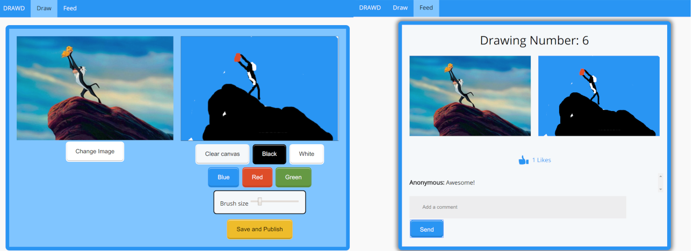

# DrawD
DrawD is a image drawing website where you attempt to draw given images. Then users are able to view, rate and make comments about all the drawings that have been made in the community.

DrawD runs on a raw node.js server and uses a SQL database. Most of the website is written in Javascript, HTML5 and CSS3, however some parts of the feed uses the AngularJS framework and JQuery library.



## Requirements

* Node.js
* SQLite3 for node.js

## Local setup

Simply run the following line to start the node server:
```
node server.js
```
Then access the website at [http://localhost:8080/index.html](http://localhost:8080/index.html)


## How to use Drawd
Using Drawd is easy, just select your image with the "change image" button, then use the tools on the right hand side to replicate the image on the canvas.

When you are done, click "save and publish" then go to the "feed" page to view all of the drawings.

Scroll down the Scroll down the bottemless feed, rating and commenting on images.

## Authors

* **Mark Irvine** 
* **Jonathan Lao**

